# Python + VSCode

## 目的
このマニュアルのみで以下を実現する

- Python環境構築
- VSCode設定
- git設定

---

# 1. Python インストール

1. 「python 3.12」と検索


2. サイト下部の「windows installer (64bit)」をクリック

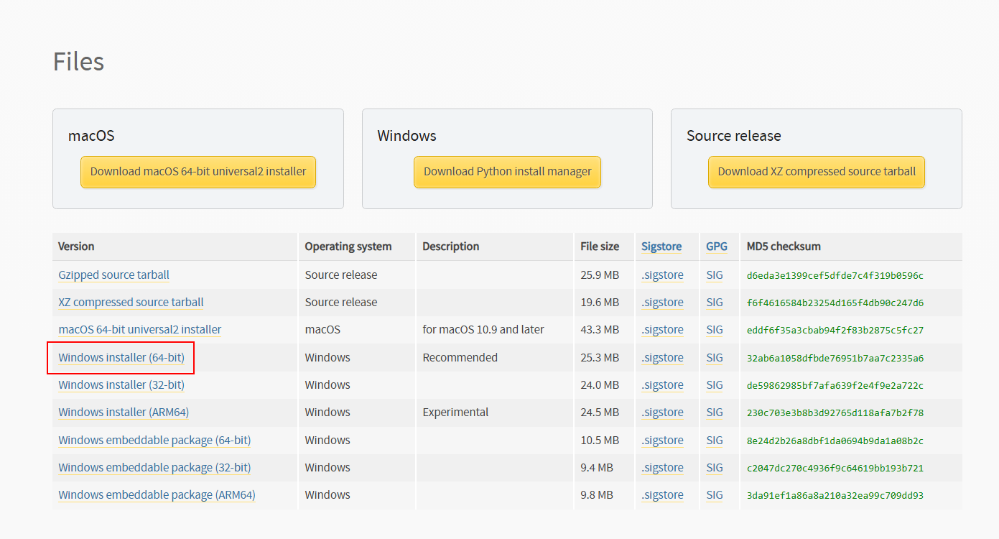

## 設定

1. インストーラーを起動(ダウンロードしたexeファイルをクリック)

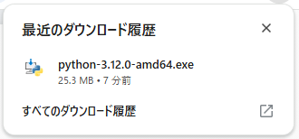

2. 「Add Python to PATH」にチェックを入れてインストール

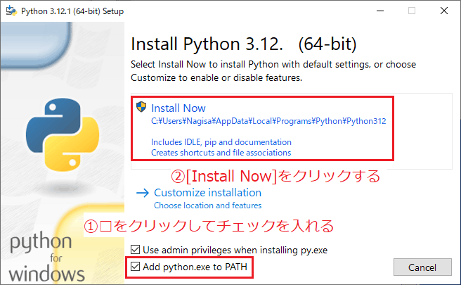

## 確認

1. 検索バーに「cmd」を入力し「コマンドプロンプト」を起動

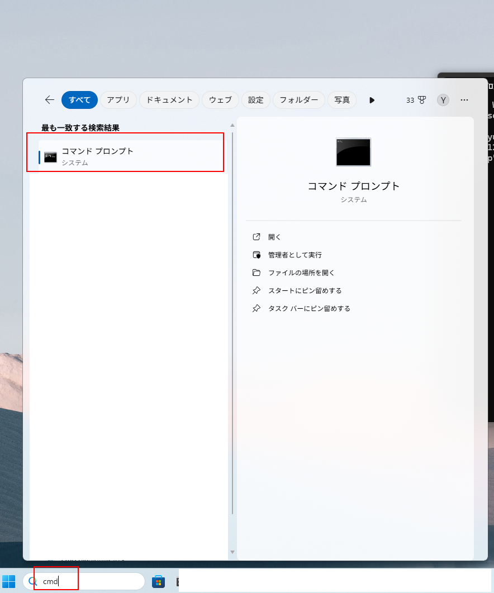

2. 「python」を入力し「エンターキー」を押下すると、「pythonの対話モード」に入る
```bash
python
```
3. 「python 3.12.0」と表示され、「>>>」の入力まち状態になれば確認完了

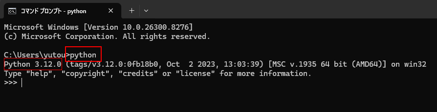

4. 「print("hello")」を入力してエンターキーを押下すると、「hello」が表示される

```bash
print("hello")
```

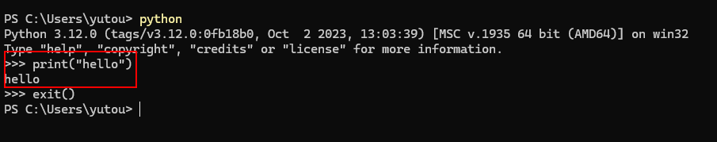

5. 「exit()」を入力してエンターキーを押下すると「pythonの対話モード」を終了する

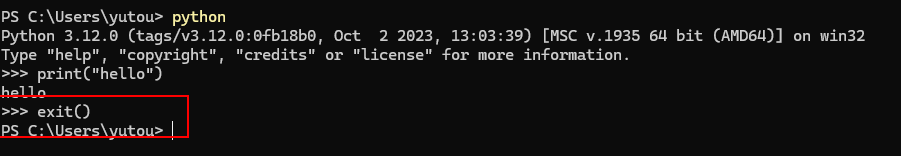

1. 「pip install uv」を入力してエンターキーを押下してパッケージ管理ライブラリ「uv」をインストールする
```bash
pip install uv
```
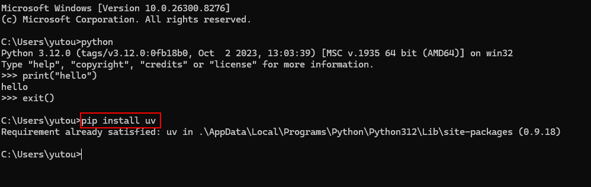

---

# 6. VSCode設定

1. webサイトからインストーラをダウンロードしてPCにインストール

https://code.visualstudio.com/

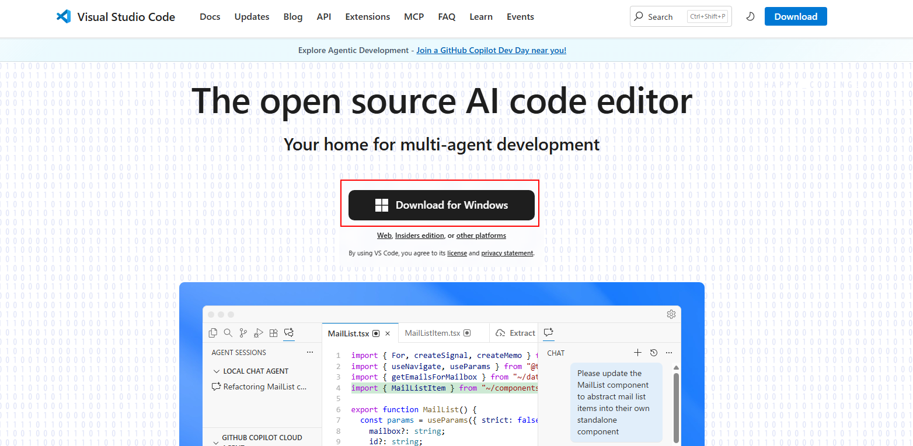


## 拡張機能のインストール

1. サイドバーの「拡張機能」を選択

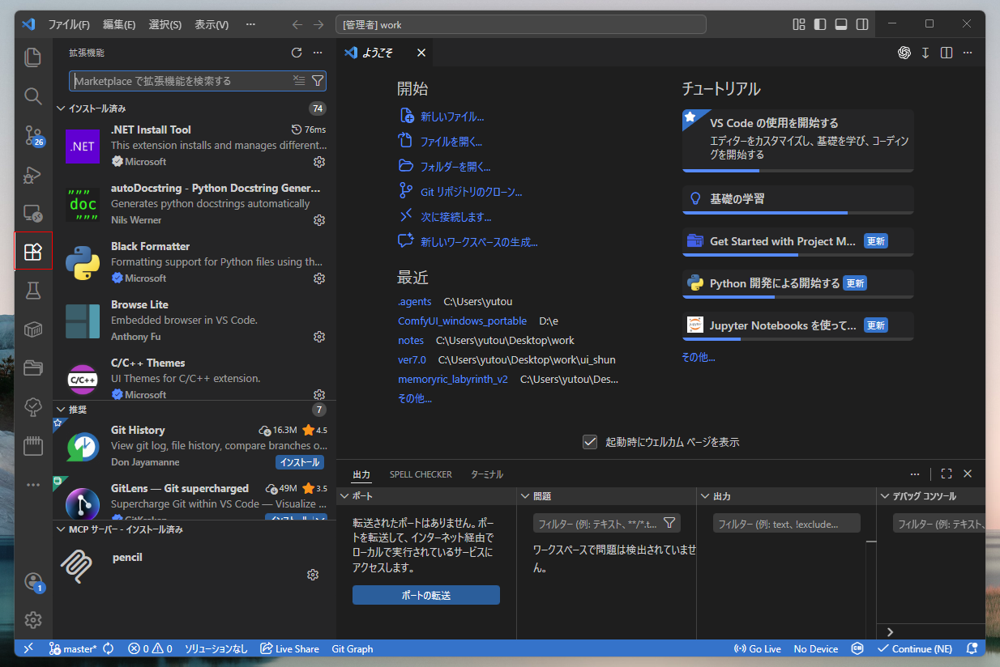

2. 検索ウィンドウから各種拡張機能を選択してインストール


|-|-|
|---|---|
|便利系|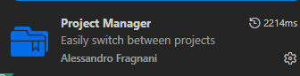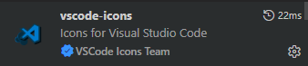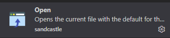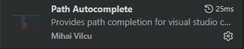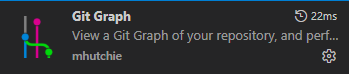|
|python|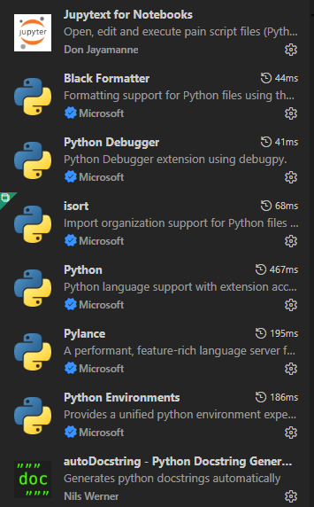|
|markdown|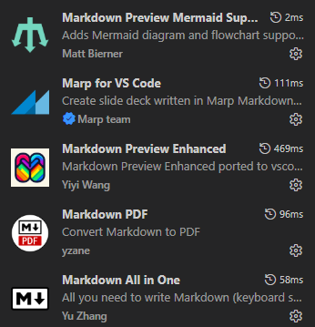|
|画像|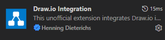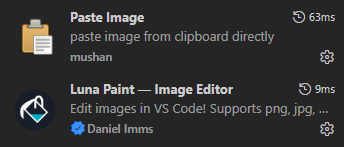|

## 作業ディレクトリの作成

2. デスクトップに「work」フォルダを作成


3. VSCodeを起動しサイドバーの「エクスプローラ」を開き、「フォルダーを開く」を選択

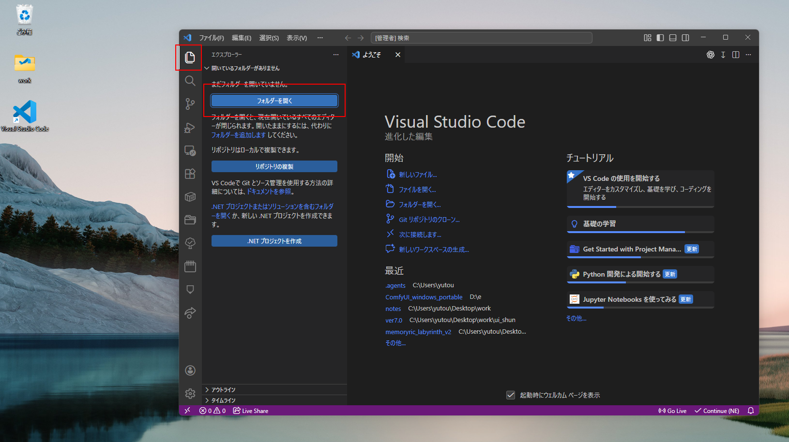

4. 作業ディレクトリとしてデスクトップに作成した「work」を選択する

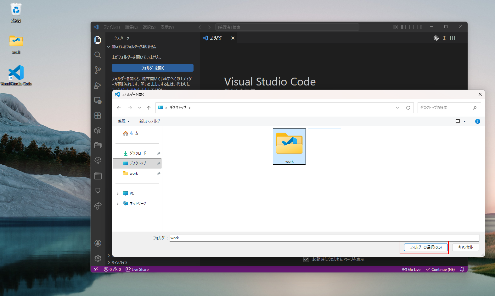

---

# git設定

1. 公式サイトからインストーラをダウンロードしてインストール

https://git-scm.com/install/windows

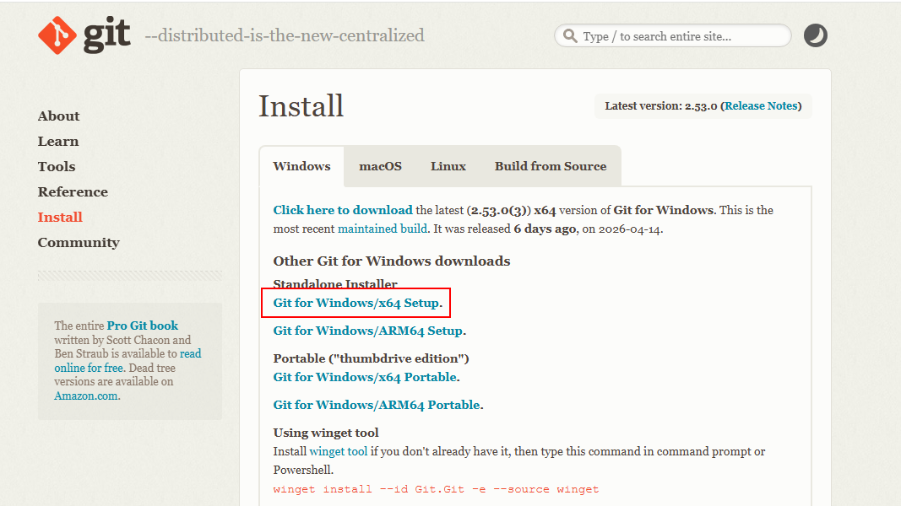

2. コマンドプロンプトに「git -v」を入力してエンターキー押下でバージョン表示が出れば終了

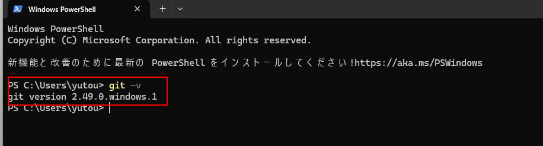

---

