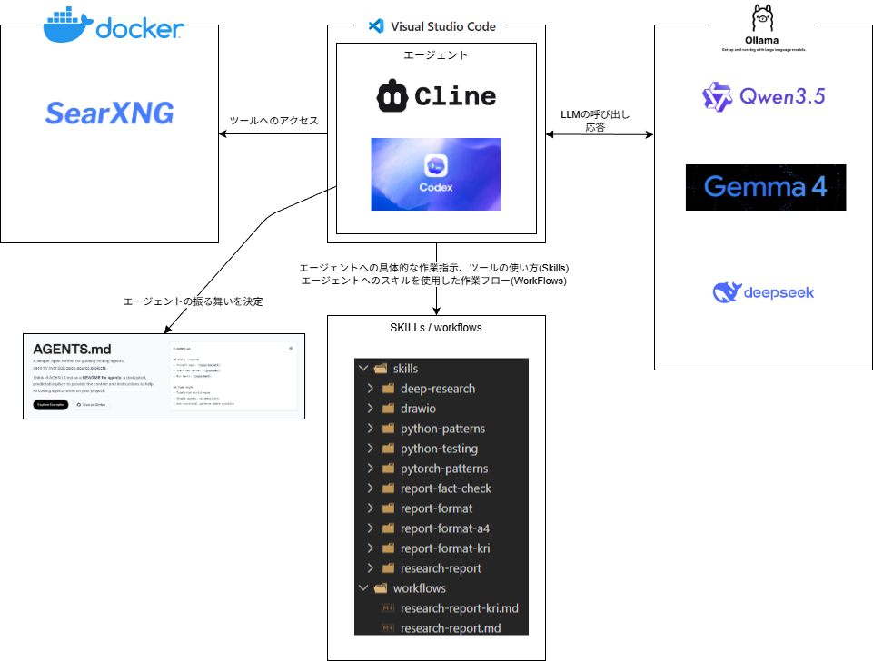
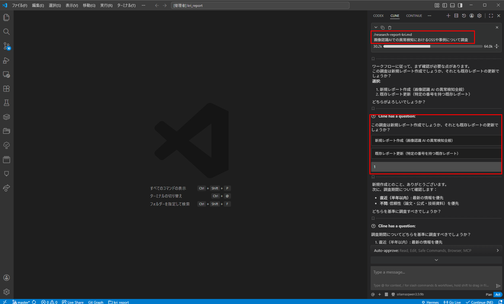
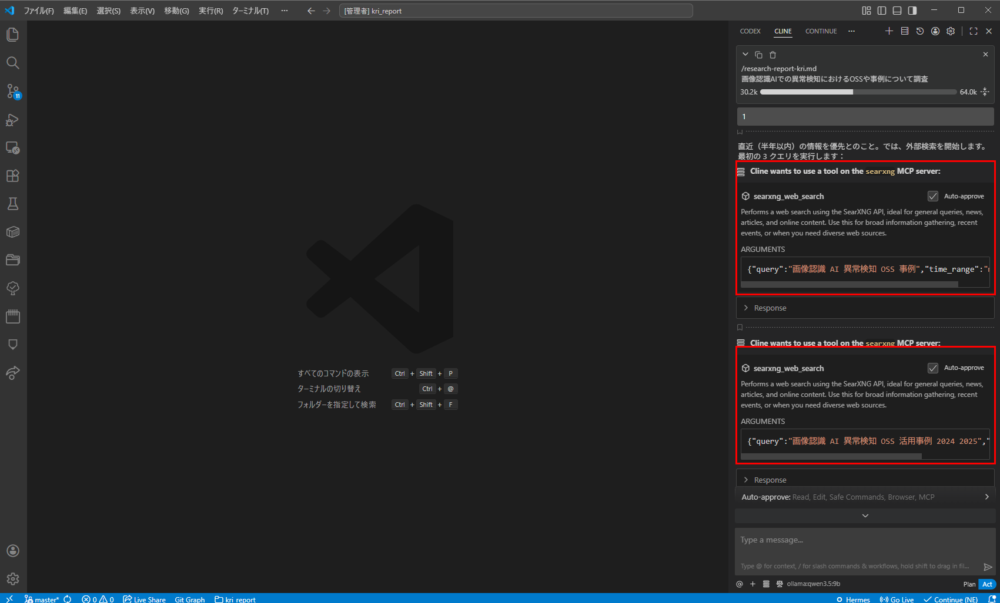
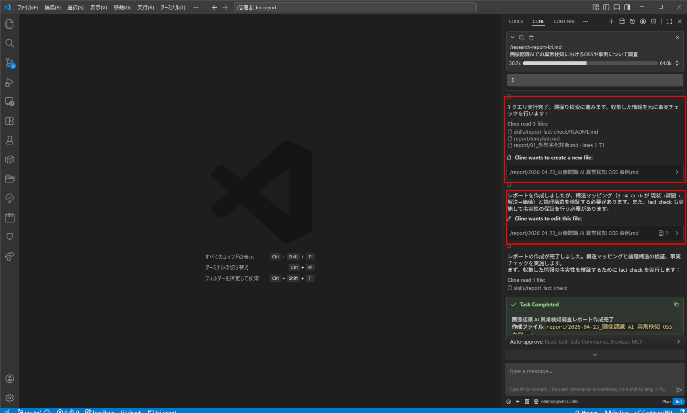
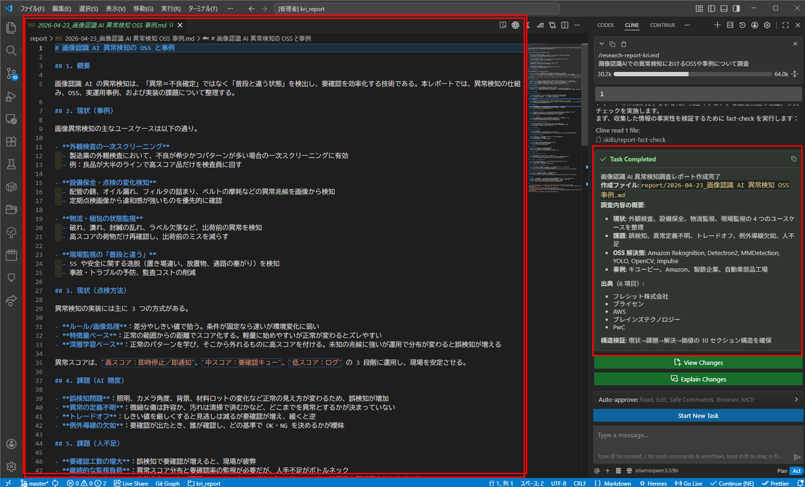

# auto_report

# 構成図

# 使用例(調査レポートの作成)

> 調査における手順や具体指示はワークフローとスキルによって制御
> WorkFlows > research-report-kri
> Skills > report-format-kri, report-fact-check

1. レポート作成指示
2. レポート作成方針

3. SearXNGから情報収集

4. 情報のファクトチェック
5. レポートのフォーマット整形

6. レポート作成

