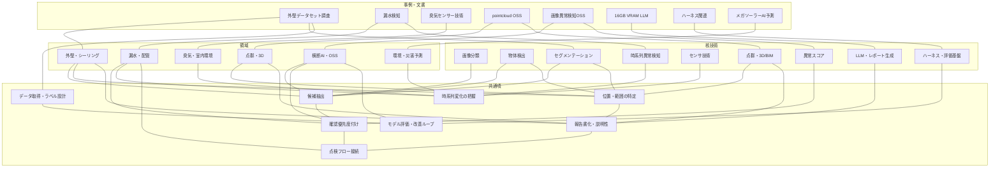

# 調査レポート頭紙

## 目的

`report/` 配下の調査レポートを、あとから見返すときの入口として整理する。
個別レポートを時系列に読むのではなく、`どの領域に、どの技術・市場論点があり、どの文書を見ればよいか` を確認するための技術マップ兼市場マップとして使う。

対象は `report/` 直下の Markdown 文書とし、A4要約配下は対象外とする。

## ドキュメント一覧

| タイトル | 作成日 | 概要 | リンク |
| --- | --- | --- | --- |
| 外壁劣化診断 | 2026-03-26 | 外壁のひび割れ、剥離、浮きなどを画像AIで扱うための初期整理。 | [01_外壁劣化診断.md](01_外壁劣化診断.md) |
| 漏水検知 | 2026-03-26 | 漏水をセンサ時系列や異常検知で扱うための初期整理。 | [02_漏水検知.md](02_漏水検知.md) |
| シーリング劣化 | 2026-03-26 | シーリングの剥離、破断、硬化などをAI診断対象として整理した初期メモ。 | [03_シーリング劣化.md](03_シーリング劣化.md) |
| 修繕措置判定手法とシーリング判定 | 2026-03-26 | 劣化検出結果を修繕要否やシーリング判定へ接続する考え方の整理。 | [04_修繕措置判定手法とシーリング判定.md](04_修繕措置判定手法とシーリング判定.md) |
| データ取得方法 | 2026-03-26 | 画像、センサ、点検データなど劣化診断に必要なデータ取得方法の整理。 | [05_データ取得方法.md](05_データ取得方法.md) |
| AI判定手法の技術整理 | 2026-03-26 | 分類、検出、セグメンテーション、異常検知などAI判定手法を横断整理した資料。 | [06_AI判定手法の技術整理.md](06_AI判定手法の技術整理.md) |
| 市場動向とAIの利用シーン | 2026-03-26 | 劣化調査市場を老朽化、人手不足、制度変化、AIサービス化の観点で整理した市場・導入動向メモ。 | [07_市場動向と技術動向.md](07_市場動向と技術動向.md) |
| 臭気センサー技術 | 2026-04-14 | 臭気・VOC・室内環境をセンサとAIで検知する技術領域の整理。 | [08_臭気センサー技術.md](08_臭気センサー技術.md) |
| 外壁劣化診断モデル調査 | 2026-04-02 | 外壁劣化診断に使うモデル候補や技術方式を整理したモデル調査。 | [09_外壁劣化診断モデル調査.md](09_外壁劣化診断モデル調査.md) |
| 建物劣化全般 | 2026-04-03 | 外壁以外も含む建物劣化全般の対象、入力データ、AI活用余地を整理した資料。 | [09_建物劣化全般.md](09_建物劣化全般.md) |
| 調査全体像 | 2026-03-26 | 外壁、漏水、シーリング、臭気、建物劣化全般について、入力データとAIの役割を領域別に整理した全体整理。 | [2026-03-26_調査全体像.md](2026-03-26_調査全体像.md) |
| AI 活用事例_漏水検査_劣化診断_レポート作成 | 2026-03-27 | 漏水検査、劣化診断、レポート作成におけるAI活用事例を整理した資料。 | [2026-03-27_AI 活用事例_漏水検査_劣化診断_レポート作成.md](2026-03-27_AI%20活用事例_漏水検査_劣化診断_レポート作成.md) |
| AI活用事例_漏水検査_劣化診断_レポート作成 | 2026-03-27 | 漏水検査、劣化診断、レポート作成におけるAI活用事例の別版資料。 | [2026-03-27_AI活用事例_漏水検査_劣化診断_レポート作成.md](2026-03-27_AI活用事例_漏水検査_劣化診断_レポート作成.md) |
| 調査まとめ | 2026-04-02 | 劣化診断・漏水・市場・AI技術に関する調査内容をまとめた横断整理。 | [2026-04-02_調査まとめ.md](2026-04-02_調査まとめ.md) |
| 16GB VRAM LLM | 2026-04-03 | 16GB VRAM環境で扱えるLLMやローカルAI実行条件を整理した技術調査。 | [2026-04-03_16GB_VRAM_LLM.md](2026-04-03_16GB_VRAM_LLM.md) |
| シーリング劣化検出 | 2026-04-03 | シーリング劣化を画像解析や点検フローで検出するための技術整理。 | [2026-04-03_シーリング劣化検出.md](2026-04-03_シーリング劣化検出.md) |
| 外壁劣化診断 | 2026-04-03 | 外壁劣化診断のAI技術、入力データ、実装論点を整理した資料。 | [2026-04-03_外壁劣化診断.md](2026-04-03_外壁劣化診断.md) |
| 外壁劣化診断_データセット事例調査 | 2026-04-03 | 外壁劣化診断に使える公開データセットや事例を整理した初期調査。 | [2026-04-03_外壁劣化診断_データセット事例調査.md](2026-04-03_外壁劣化診断_データセット事例調査.md) |
| 外壁劣化診断_応用技術解析ソリューション | 2026-04-03 | 外壁劣化診断を応用技術や解析ソリューションとして展開する観点の整理。 | [2026-04-03_外壁劣化診断_応用技術解析ソリューション.md](2026-04-03_外壁劣化診断_応用技術解析ソリューション.md) |
| 外壁劣化診断_技術検証事例調査 | 2026-04-03 | 外壁劣化診断の技術検証事例や実証観点を整理した資料。 | [2026-04-03_外壁劣化診断_技術検証事例調査.md](2026-04-03_外壁劣化診断_技術検証事例調査.md) |
| ComfyUI | 2026-04-04 | ComfyUIを使った画像生成・画像処理ワークフローの技術整理。 | [2026-04-04_ComfyUI.md](2026-04-04_ComfyUI.md) |
| LLm ハーネス メタハーネス | 2026-04-04 | LLMハーネスやメタハーネスによる評価・実行制御の整理。 | [2026-04-04_LLm ハーネス メタハーネス.md](2026-04-04_LLm%20ハーネス%20メタハーネス.md) |
| ハーネスエンジニアリングステアリングループ | 2026-04-07 | ハーネスエンジニアリングとステアリングループによるAI開発運用の整理。 | [2026-04-07_ハーネスエンジニアリングステアリングループ.md](2026-04-07_ハーネスエンジニアリングステアリングループ.md) |
| 物体検知モデル可視化 OSS ツール | 2026-04-08 | 物体検知モデルの結果を可視化・検証するOSSツールの整理。 | [2026-04-08_物体検知モデル可視化 OSS ツール.md](2026-04-08_物体検知モデル可視化%20OSS%20ツール.md) |
| 画像解析可視化 OSS 一覧 | 2026-04-09 | 画像解析結果を可視化するOSSや検証支援ツールを一覧化した調査。 | [2026-04-09_画像解析可視化 OSS 一覧.md](2026-04-09_画像解析可視化%20OSS%20一覧.md) |
| 日本のメガソーラーの環境問題・災害防止に関する AI 予測事例 | 2026-04-09 | メガソーラーの環境問題や災害防止に関するAI予測事例を整理した調査。 | [2026-04-09_日本のメガソーラーの環境問題・災害防止に関する AI 予測事例.md](2026-04-09_日本のメガソーラーの環境問題・災害防止に関する%20AI%20予測事例.md) |
| シーリング劣化検出 | 2026-04-10 | シーリング劣化検出の技術、データ、判定フローを更新整理した資料。 | [2026-04-10_シーリング劣化検出.md](2026-04-10_シーリング劣化検出.md) |
| 外壁劣化診断_データセット事例調査 | 2026-04-10 | 外壁劣化診断とシーリング検出に使うAIモデル、OSSデータセット、業界事例を整理した技術調査。 | [2026-04-10_外壁劣化診断_データセット事例調査.md](2026-04-10_外壁劣化診断_データセット事例調査.md) |
| 漏水検知 | 2026-04-10 | 音響、振動、圧力、流量などのセンサデータを使った漏水検知方式と製品・サービス事例の整理。 | [2026-04-10_漏水検知.md](2026-04-10_漏水検知.md) |
| 臭気センサー技術 | 2026-04-14 | 臭気センサー、VOC、IoTセンサーを使った臭気・室内環境検知の更新調査。 | [2026-04-14_臭気センサー技術.md](2026-04-14_臭気センサー技術.md) |
| pointcloud OSS | 2026-04-23 | 点群データの処理・可視化OSSについて、機能、メタデータ連携、Web可視化、ライセンス制約を比較した調査。 | [2026-04-22_pointcloud_oss.md](2026-04-22_pointcloud_oss.md) |
| 画像認識 AI 異常検知の OSS と事例 | 2026-04-23 | 画像異常検知の方式、OSS候補、異常スコア運用、誤検知やしきい値設計の課題を整理した調査。 | [2026-04-23_画像認識 AI 異常検知 OSS 事例.md](2026-04-23_画像認識%20AI%20異常検知%20OSS%20事例.md) |

## 技術マップ

縦軸に技術を追加していく。セルには、その領域での使いどころと参照ドキュメントを短く書く。

| 技術 | 全体・市場 | 外壁・シーリング | 漏水・配管 | 点群・3D | 横断AI・OSS |
| --- | --- | --- | --- | --- | --- |
| 画像分類 | AI導入の入口。[全体像](2026-03-26_調査全体像.md) | 劣化有無の一次判定。[外壁診断](2026-04-03_外壁劣化診断.md) | - | - | 正常/異常の振り分け。[画像異常検知](2026-04-23_画像認識%20AI%20異常検知%20OSS%20事例.md) |
| 物体検出 | 点検候補抽出の省力化。[市場動向](07_市場動向と技術動向.md) | ひび割れ・剥離・浮き候補の位置検出。[技術検証事例](2026-04-03_外壁劣化診断_技術検証事例調査.md) | - | - | 可視化OSSで検証。[物体検知可視化OSS](2026-04-08_物体検知モデル可視化%20OSS%20ツール.md) |
| セマンティックセグメンテーション | 面積・範囲を扱う点検に向く。[AI判定手法](06_AI判定手法の技術整理.md) | 劣化領域の面積・形状把握。[外壁データセット](2026-04-10_外壁劣化診断_データセット事例調査.md) | - | - | Detectron2/MMDetection等と比較。[画像異常検知](2026-04-23_画像認識%20AI%20異常検知%20OSS%20事例.md) |
| インスタンスセグメンテーション | 件数管理・個別管理向き。[AI判定手法](06_AI判定手法の技術整理.md) | 個別クラックや欠損の分離。[外壁モデル調査](09_外壁劣化診断モデル調査.md) | - | - | Mask R-CNN系の候補。[画像異常検知](2026-04-23_画像認識%20AI%20異常検知%20OSS%20事例.md) |
| 時系列異常検知 | 常時監視型サービスの中心。[全体像](2026-03-26_調査全体像.md) | - | 音響・振動・圧力・流量の本流。[漏水検知](2026-04-10_漏水検知.md) | - | 異常スコア運用と接続。[画像異常検知](2026-04-23_画像認識%20AI%20異常検知%20OSS%20事例.md) |
| 音響・振動・圧力センサ | センサ型DXの代表例。[全体像](2026-03-26_調査全体像.md) | - | 漏水検知の中心。[漏水検知](2026-04-10_漏水検知.md) | - | - |
| 臭気・VOCセンサ | 室内環境管理の一部。[全体像](2026-03-26_調査全体像.md) | - | - | - | 臭気パターン認識。[臭気センサー技術](2026-04-14_臭気センサー技術.md) |
| 点群・3D/BIM | 維持管理フロー接続に有効。[調査まとめ](2026-04-02_調査まとめ.md) | 外壁位置、面積、撮影位置管理。[pointcloud OSS](2026-04-22_pointcloud_oss.md) | - | 主対象。[pointcloud OSS](2026-04-22_pointcloud_oss.md) | AI結果の可視化・確認画面に接続。[画像解析可視化OSS](2026-04-09_画像解析可視化%20OSS%20一覧.md) |
| 異常スコア運用 | 人が見る量を減らす運用設計。[市場動向](07_市場動向と技術動向.md) | 要確認画像の優先順位付け。[シーリング劣化検出](2026-04-10_シーリング劣化検出.md) | アラート優先度付け。[漏水検知](2026-04-10_漏水検知.md) | 変化箇所の確認優先度付け。[pointcloud OSS](2026-04-22_pointcloud_oss.md) | 高/中/低スコア運用。[画像異常検知](2026-04-23_画像認識%20AI%20異常検知%20OSS%20事例.md) |
| データセット設計 | 取得条件とラベル設計が性能を左右。[データ取得方法](05_データ取得方法.md) | dacl1k、SDNET2018等。[外壁データセット](2026-04-10_外壁劣化診断_データセット事例調査.md) | センサ配置・ノイズ条件が重要。[漏水検知](2026-04-10_漏水検知.md) | 点群形式・メタデータ損失が論点。[pointcloud OSS](2026-04-22_pointcloud_oss.md) | 学習・評価データ管理。[画像異常検知](2026-04-23_画像認識%20AI%20異常検知%20OSS%20事例.md) |
| 可視化・検証OSS | AI結果の説明性を高める。[調査まとめ](2026-04-02_調査まとめ.md) | 検出結果の確認・報告に有効。[画像解析可視化OSS](2026-04-09_画像解析可視化%20OSS%20一覧.md) | - | 点群ビューアが中心。[pointcloud OSS](2026-04-22_pointcloud_oss.md) | 物体検知・画像解析OSS。[物体検知可視化OSS](2026-04-08_物体検知モデル可視化%20OSS%20ツール.md) |
| LLM・レポート生成 | 報告書作成支援に接続。[AI活用事例](2026-03-27_AI活用事例_漏水検査_劣化診断_レポート作成.md) | - | - | - | ローカルLLM・評価基盤。[16GB VRAM LLM](2026-04-03_16GB_VRAM_LLM.md) |
| ComfyUI・画像処理ワークフロー | 画像生成・処理の試作基盤。[ComfyUI](2026-04-04_ComfyUI.md) | - | - | - | ワークフロー型AI処理。[ComfyUI](2026-04-04_ComfyUI.md) |
| ハーネス・評価ループ | AI開発運用の制御基盤。[ハーネス](2026-04-04_LLm%20ハーネス%20メタハーネス.md) | モデル評価・改善ループに有効。 | アラート精度の改善ループに有効。 | 可視化・処理パイプライン評価に有効。 | メタハーネスとステアリングループ。[ステアリングループ](2026-04-07_ハーネスエンジニアリングステアリングループ.md) |
| 環境・災害予測AI | 維持管理のリスク予測に接続。[メガソーラーAI](2026-04-09_日本のメガソーラーの環境問題・災害防止に関する%20AI%20予測事例.md) | - | - | 地形・施設データ活用と接続。 | 予測AIの横断事例。[メガソーラーAI](2026-04-09_日本のメガソーラーの環境問題・災害防止に関する%20AI%20予測事例.md) |

### 技術・領域 相関ノードグラフ

核技術、対象領域、事例・文書が、どの共通項を抱えているかを見るための相関ノードグラフ。

## 市場マップ

縦軸に市場・導入論点を追加していく。技術そのものではなく、`なぜ必要か`、`どう売れるか`、`導入時に何を見るか` を整理する。

| 市場・導入論点 | 全体・市場 | 外壁・シーリング | 漏水・配管 | 点群・3D | 横断AI・OSS |
| --- | --- | --- | --- | --- | --- |
| 老朽化 | 点検対象が増える。[市場動向](07_市場動向と技術動向.md) | 外壁点検・修繕判断の需要増。[市場動向](07_市場動向と技術動向.md) | 管路老朽化による漏水リスク増。[漏水検知](2026-04-10_漏水検知.md) | 既存構造物のデジタル管理需要。[pointcloud OSS](2026-04-22_pointcloud_oss.md) | 監視・点検の自動化需要。[画像異常検知](2026-04-23_画像認識%20AI%20異常検知%20OSS%20事例.md) |
| 人手不足 | 点検を従来通り回せない。[市場動向](07_市場動向と技術動向.md) | 画像候補抽出で確認工数を減らす。[外壁診断](2026-04-03_外壁劣化診断.md) | 常時監視で巡回負荷を下げる。[漏水検知](2026-04-10_漏水検知.md) | 遠隔確認・共有で現地依存を下げる。[pointcloud OSS](2026-04-22_pointcloud_oss.md) | 要確認キュー化で確認量を制御。[画像異常検知](2026-04-23_画像認識%20AI%20異常検知%20OSS%20事例.md) |
| 制度・点検対応 | 制度に乗る運用形が重要。[市場動向](07_市場動向と技術動向.md) | ドローン・赤外線・報告書化が論点。[市場動向](07_市場動向と技術動向.md) | 水道・インフラDXの文脈。[漏水検知](2026-04-10_漏水検知.md) | 成果物管理・証跡管理が論点。[pointcloud OSS](2026-04-22_pointcloud_oss.md) | AI単体より運用フローへの組込み。[画像異常検知](2026-04-23_画像認識%20AI%20異常検知%20OSS%20事例.md) |
| サービス化 | AI単体では売りにくい。[市場動向](07_市場動向と技術動向.md) | 調査、抽出、人確認、報告書化まで一体化。[AI活用事例](2026-03-27_AI活用事例_漏水検査_劣化診断_レポート作成.md) | リスク推定から位置特定まで一気通貫。[漏水検知](2026-04-10_漏水検知.md) | 可視化・共有・メタデータ管理まで含める。[pointcloud OSS](2026-04-22_pointcloud_oss.md) | OSSは実装部品、価値は運用設計。[画像解析可視化OSS](2026-04-09_画像解析可視化%20OSS%20一覧.md) |
| データ制約 | データ取得条件で性能が変わる。[データ取得方法](05_データ取得方法.md) | 撮影距離・解像度・光条件が重要。[外壁データセット](2026-04-10_外壁劣化診断_データセット事例調査.md) | センサ配置・頻度・ノイズが重要。[漏水検知](2026-04-10_漏水検知.md) | 点数、形式、メタデータ損失が重要。[pointcloud OSS](2026-04-22_pointcloud_oss.md) | 正常分布の変化で誤検知が増える。[画像異常検知](2026-04-23_画像認識%20AI%20異常検知%20OSS%20事例.md) |
| 修繕・判定接続 | 検出後の判断が価値になる。[修繕措置判定](04_修繕措置判定手法とシーリング判定.md) | シーリング判定・補修判断に接続。[シーリング劣化検出](2026-04-10_シーリング劣化検出.md) | 漏水箇所特定後の修繕判断に接続。[漏水検知](2026-04-10_漏水検知.md) | 位置情報が修繕計画に効く。[pointcloud OSS](2026-04-22_pointcloud_oss.md) | 判定履歴・説明性が必要。[画像異常検知](2026-04-23_画像認識%20AI%20異常検知%20OSS%20事例.md) |
| OSS導入・内製化 | コストと自由度の比較論点。[調査まとめ](2026-04-02_調査まとめ.md) | モデル・データセット選定が中心。[外壁データセット](2026-04-10_外壁劣化診断_データセット事例調査.md) | センサ製品との組み合わせが中心。[漏水検知](2026-04-10_漏水検知.md) | ライセンス・WebGL・大規模点群が論点。[pointcloud OSS](2026-04-22_pointcloud_oss.md) | OSSツール比較が中心。[画像解析可視化OSS](2026-04-09_画像解析可視化%20OSS%20一覧.md) |
| AI開発効率化 | 試作・評価・改善の短縮が論点。[ハーネス](2026-04-04_LLm%20ハーネス%20メタハーネス.md) | 劣化モデルの評価ループに有効。[技術検証事例](2026-04-03_外壁劣化診断_技術検証事例調査.md) | アラート精度改善に有効。[漏水検知](2026-04-10_漏水検知.md) | 可視化パイプライン評価に有効。[pointcloud OSS](2026-04-22_pointcloud_oss.md) | LLM・ハーネス・ComfyUIで試作を支える。[ComfyUI](2026-04-04_ComfyUI.md) |
| 環境・災害リスク | 予防保全の周辺市場。[メガソーラーAI](2026-04-09_日本のメガソーラーの環境問題・災害防止に関する%20AI%20予測事例.md) | - | - | 地形・施設データ活用と接続。 | 予測AIの横断事例。[メガソーラーAI](2026-04-09_日本のメガソーラーの環境問題・災害防止に関する%20AI%20予測事例.md) |

### 市場 相関ノードグラフ

市場、事例、提供形態が、どの共通項を抱えているかを見るための相関ノードグラフ。

```mermaid
flowchart TB
    subgraph CORE_M[共通項]
        CM1[人が見る量を減らす]
        CM2[判断を説明可能にする]
        CM3[現場データを継続取得する]
        CM4[制度・点検業務に接続する]
        CM5[導入判断を短くする]
        CM6[修繕・対策へつなぐ]
        CM7[AI開発を回しやすくする]
    end

    subgraph DRIVER[市場要因]
        AGING[老朽化]
        LABOR[人手不足]
        REG[制度・点検対応]
        RISK[事故・損失リスク]
        COST[導入コスト]
    end

    subgraph MARKET[市場・領域]
        WALL_M[外壁・シーリング]
        LEAK_M[漏水・配管]
        ODOR_M[臭気・室内環境]
        P3D_M[点群・3D]
        ENV_M[環境・災害予測]
        AI_M[横断AI・OSS]
    end

    subgraph OFFER[事例・提供形態]
        SERVICE[調査 + AI + 人確認 + 報告書]
        MONITOR[常時監視 + アラート]
        TOOL[OSS/ツール導入]
        VIEWER[可視化・共有基盤]
        REPORT[LLM・レポート作成]
        LOOP[ハーネス・評価ループ]
    end

    AGING --- WALL_M
    AGING --- LEAK_M
    AGING --- P3D_M
    LABOR --- CM1
    REG --- CM4
    RISK --- CM2
    RISK --- CM6
    COST --- CM5

    WALL_M --- CM1
    WALL_M --- CM2
    WALL_M --- CM4
    WALL_M --- CM6
    LEAK_M --- CM1
    LEAK_M --- CM3
    LEAK_M --- CM6
    ODOR_M --- CM3
    P3D_M --- CM2
    P3D_M --- CM5
    ENV_M --- CM6
    AI_M --- CM1
    AI_M --- CM5
    AI_M --- CM7

    SERVICE --- CM1
    SERVICE --- CM2
    SERVICE --- CM4
    MONITOR --- CM1
    MONITOR --- CM3
    VIEWER --- CM2
    VIEWER --- CM5
    TOOL --- CM1
    TOOL --- CM5
    REPORT --- CM2
    REPORT --- CM5
    LOOP --- CM7

    CM1 --- CM5
    CM2 --- CM4
    CM2 --- CM6
    CM3 --- CM4
    CM5 --- CM7
```

## ルール

### 更新ルール

- 新しい調査レポートを追加したら、`ドキュメント一覧` に `タイトル`、`作成日`、`概要`、`リンク` を追加する。
- ドキュメント一覧の `概要` は、読む目的ではなく、そのドキュメント自体が何を整理したものかを1文で説明する。
- 新しい調査レポートを追加するときは、原則として `00_top.md` と追加対象ドキュメントだけを参照して追記する。
- 既存の他ドキュメントを読み直さないと判断できない粒度の追記は避け、追加対象ドキュメントから分かる範囲で整理する。
- 新しい調査レポートを追加したら、`技術マップ` または `市場マップ` にも1行以上追加する。
- 技術マップ・市場マップの横軸は、変動が少ない `領域` に固定する。
- 技術マップ・市場マップの縦軸には、追加頻度が高い `技術` または `市場論点` を置く。
- 横軸の領域は原則増やさない。新しいテーマは、まず既存領域のどこに近いかで分類する。
- 技術マップ・市場マップのセルには、`超短い要約 + ドキュメントリンク` を入れる。
- 技術マップ・市場マップで関連がない、または関連が薄いセルは `-` とし、説明を入れない。
- 技術・領域 相関ノードグラフと市場 相関ノードグラフには、表だけでは見えにくい `技術`、`領域`、`事例`、`市場論点`、`共通項` の関係を追記する。
- 1つのレポートが複数領域にまたがる場合は、主領域に置き、関連領域には補助リンクとして入れる。
- 古いメモと詳細レポートが重複する場合は、詳細レポートを優先参照先にする。

| 固定横軸 | 含める範囲 |
| --- | --- |
| 全体・市場 | 老朽化、人手不足、制度、導入判断、サービス化 |
| 外壁・シーリング | 外壁劣化、ひび割れ、剥離、浮き、シーリング劣化 |
| 漏水・配管 | 漏水、管路、配管、音響・振動・圧力・流量センサ |
| 点群・3D | 点群、3D、BIM、Web可視化、メタデータ連携 |
| 横断AI・OSS | 画像異常検知、物体検出、OSS、運用設計 |
