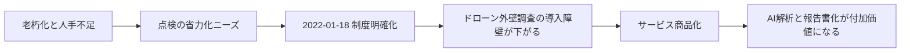
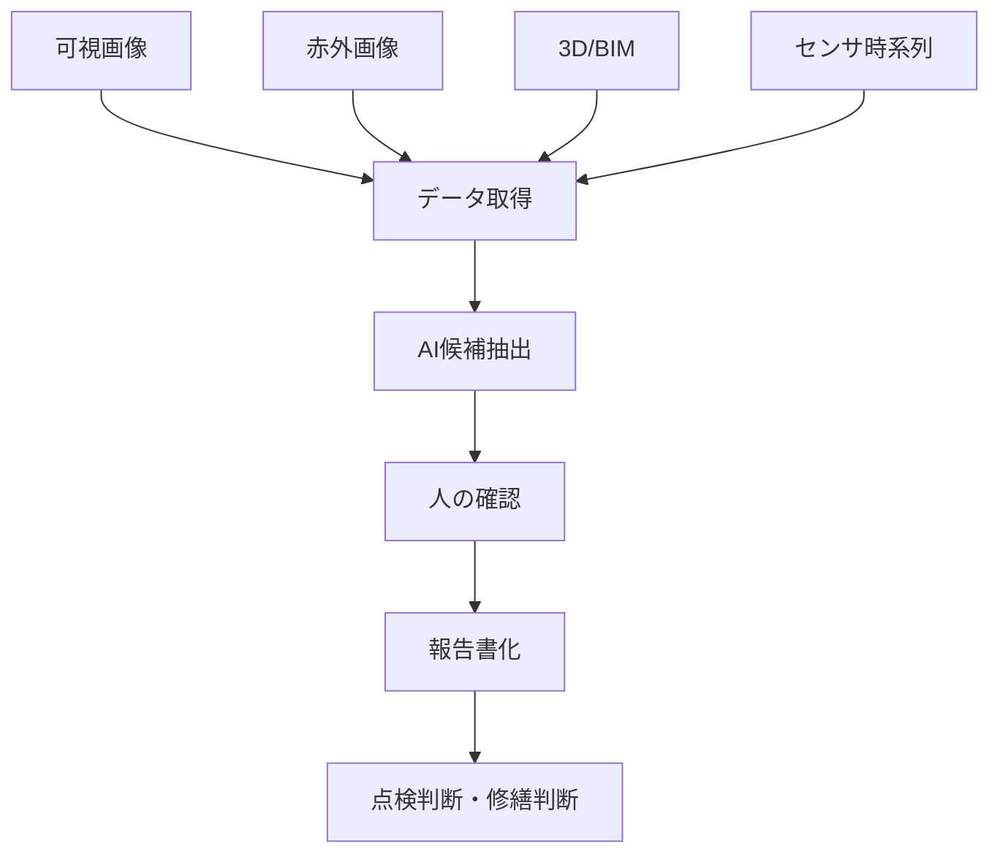

# 市場動向とAIの利用シーン

## この資料の狙い

劣化調査まわりの市場動向と、そこで AI がどこに入っているのかを、読み物として流れで理解しやすい形に整理する。  
ここでは 2022年から 2026年3月26日 時点までに公開情報で確認できる内容をもとに、`なぜ市場が伸びるのか` `AIは何を置き換え、何を置き換えないのか` をつなげて見る。[^mt1][^mt2]

## 先に結論

- 市場を押している主因は、`老朽化の進行` と `担い手不足`。
- 外壁領域では、2022年1月18日の制度明確化を契機に、`ドローン + 赤外線 + AI` を業務として売りやすくなった。[^mt1]
- 実務で売られているのは AI 単体ではなく、`調査実施 + 候補抽出 + 人の確認 + 報告書化` まで含むサービス。
- 技術競争の軸は、`検出精度` だけでなく `レポート化` `法定点検対応` `維持管理フロー接続` に移っている。
- AI の使いどころは、`完全自動判定` より `人が見る量を減らす前処理` と `報告業務の省力化` にある。

---

## 1. 市場はなぜ動いているのか

まず大きいのは、建築・インフラの老朽化が避けられないこと。国土交通白書2024では、建設後50年以上経過する社会資本の割合が今後増えると整理されている。さらに国土交通白書2025では、2024年時点の建設業就業者のうち `55歳以上が36.7%`、`29歳以下が11.7%` とされ、若手不足と高齢化が同時進行している。[^mt3][^mt4]

つまり市場の本質は、`点検件数が増える` だけではない。  
正確には、`見なければいけない対象は増えるのに、従来通り人手で回すのが難しい` という構図にある。

```text
老朽化の進行
    ↓
点検・補修判断の必要件数が増える
    ↓
一方で担い手は不足する
    ↓
省力化された調査フローが必要になる
    ↓
ドローン・画像解析・AI・帳票自動化の需要が高まる
```

この流れで見ると、AI は「新しいことをする技術」というより、`既存の点検業務を回し続けるための補助技術` として入ってきている。

## 2. 市場化を後押しした制度変化

市場化の節目として重要なのは、2022年1月18日の国土交通省告示改正。これにより、一定条件を満たす `無人航空機による赤外線調査` が、打診以外の外壁調査方法として明確化された。[^mt1]

この意味は大きい。制度上の位置づけが曖昧なままだと、技術があっても業務として売りにくい。逆にここが明確になると、`12条点検対応` や `修繕前調査` の形でサービスを組みやすくなる。実際に楽天ドローンは、定期点検や修繕前調査を前面に出した提供形態を示している。[^mt5]



ここで重要なのは、制度が認めたのは「AI」そのものではなく、`業務フローの一部として使う調査手段` だという点。  
そのため市場では、AI 単品より `制度に乗る運用形` が先に立つ。

## 3. 何が売られているのか

公開情報を見ると、実務で売られているのは「ひび割れ検出モデル」ではない。  
売られているのは、次のような一連の仕事である。

```text
事前計画
  ↓
現地調査・飛行・撮影
  ↓
AIで候補抽出
  ↓
専門スタッフが確認
  ↓
図面・プロット・報告書に落とす
  ↓
点検・修繕判断フローへ接続
```

楽天ドローンは、2017年4月から2025年12月末までの累計で `800棟超`、全国 `200社以上` の実績を掲げ、調査から画像解析、報告書提出までを一体で提供している。[^mt5]  
竹中工務店の `Façade Inspector` も、問題箇所の抽出だけでなく、日本語 UI・日本語レポート・国内向け検査項目対応を打ち出している。[^mt6]

このため、競争の中心は `AIがあるかどうか` ではなく、`AIを含めてどこまで業務を短く・安く・標準化できるか` にある。

## 4. AIはどこで使われるのか

AI の利用シーンを業務フローに沿って見ると、次の整理が分かりやすい。

| 業務段階 | 主な入力 | AI の役割 | 人が残る役割 |
| --- | --- | --- | --- |
| 調査計画 | 建物情報、3D都市モデル、日照条件 | 撮影条件の最適化、実施計画支援 | 実施判断、制約確認 |
| 調査実施 | 可視画像、赤外画像、ドローン撮影画像 | ブレ検知、撮影品質確認の補助 | 飛行・安全管理、現場判断 |
| 一次解析 | 画像、時系列データ | ひび割れ候補、浮き候補、異常候補の抽出 | 候補の妥当性確認 |
| 二次判断 | 候補一覧、原画像、点検基準 | 優先度付け、整理、比較表示 | 最終判定、見落とし確認 |
| 帳票化 | 判定結果、位置情報、図面 | プロット生成、報告書ドラフト作成 | 対外説明に耐える形へ整える |

この表から見えてくるのは、AI が最も効きやすいのが `候補抽出` と `帳票化` の2か所だということ。  
逆に、制度責任や安全責任が重い `最終判定` `現場実施判断` は、まだ人が主役のまま。

## 5. 領域別に見るAIの使い方

### 5-1. 外壁

外壁は、もっとも AI と相性が良い。理由は、画像を主要な入力として扱いやすいから。近年の流れは、`可視画像のみ` から `可視 + 赤外 + 3D/BIM` の組み合わせへ進んでいる。PLATEAU の実証でも、3D都市モデルを用いた日照・反射光シミュレーションで、ドローン赤外線調査の計画立案を支援している。[^mt7][^mt8]

ここでの AI 利用シーンは、主に以下。

- ひび割れや浮き候補の抽出
- 可視画像と赤外画像の突合
- 点検対象位置の整理
- 報告書やプロット図の生成補助

要するに外壁では、`撮る前の準備` から `撮った後の整理` まで、画像ワークフロー全体に AI が入りやすい。

### 5-2. 漏水・設備

漏水や設備異常は、外壁ほど「画像一発」で片付きにくい。主入力は、音響、圧力、流量、振動などの時系列データになりやすく、AI の役割も `異常検知` `兆候検知` `位置推定` が中心になる。

デジタル庁の技術検証事業では、2024年3月29日に公表された類型4で、`センサー、AI解析等を活用した設備の状態の定期点検` が扱われている。[^mt10]  
この領域では、AI は単発の判定器というより、`常時監視の中で異常を早く気づく仕組み` として使われる。

### 5-3. シーリング

シーリングは、外壁点検の一部として扱うのが自然で、単独の AI サービスとして切り出すより、`外壁全体の点検フローの中でどう拾うか` が論点になる。  
画像から読みやすいのは表面劣化や破断の一部だが、接着状態や内部状態は別の確認が必要になりやすい。したがって AI の役割は、`単独で断定すること` より `近接確認が必要な箇所を絞ること` に寄る。

## 6. 技術トレンドをひと目で見る

### 6-1. 以前の考え方

- 撮影する
- AI が異常を出す
- 結果を見る

### 6-2. 現在の実装トレンド

- 調査計画を立てる
- 必要なら 3D/BIM や環境条件を使う
- 可視・赤外・センサなど複数データを取る
- AI で候補抽出する
- 人が確認する
- レポート化して維持管理フローへつなぐ

この違いを図にすると、次のイメージになる。



この構造では、AI は真ん中にいる。  
入口のデータ品質が悪ければ効かず、出口の業務フローにつながらなければ価値になりにくい。

## 7. 今の市場を読むときのポイント

### 7-1. AI単体の性能競争だけでは読めない

実務では、精度が少し高いだけでは優位になりにくい。  
現場で評価されるのは、次のような複合的な価値。

- 法定点検や修繕前調査に使いやすいか
- レポート作成が早いか
- 人の確認工数が減るか
- 継続運用できる価格と体制か
- 維持管理台帳や既存フローにつながるか

### 7-2. 完全自動化を前提にしない方が現実に合う

楽天ドローンの2026年2月17日公表資料でも、AI が候補抽出した後に専門スタッフが確認する運用が明示されている。[^mt9]  
現時点では、`AIが全部決める` ではなく `AIで見る量を減らし、人が責任を持つ` 形の方が、制度面にも実務面にもなじみやすい。

### 7-3. 今後は検出より「接続」の価値が増える

今後の差別化は、検出器単体よりも、次の接続部分で広がる可能性が高い。

- 点検計画との接続
- 帳票作成との接続
- 維持管理データベースとの接続
- 経年比較との接続
- 修繕判断フローとの接続

つまり、AI は「単体プロダクト」より `維持管理オペレーションの一部品` として見た方が実態に近い。

## 8. 総括

市場動向と AI の利用シーンをまとめると、次の一文に集約できる。

> 劣化調査市場では、老朽化と人手不足を背景に、AI は完全自動判定のためというより、調査から報告までの業務を回しやすくするために導入されている。

この見方に立つと、今後見るべき論点もはっきりする。

1. どの領域で、どの入力データが主役なのか
2. AI が減らせるのは、どの人手なのか
3. 最終的にどの業務フローへ接続されるのか

この3点で整理すると、外壁、漏水、シーリングの違いも読みやすくなる。

## 出典

[^mt1]: https://www.mlit.go.jp/jutakukentiku/build/jutakukentiku_house_tk_000161.html 国土交通省「定期報告制度における外壁のタイル等の調査について」。2022年1月18日付告示改正により、無人航空機による赤外線調査の位置づけを明確化。
[^mt2]: https://www.digital.go.jp/policies/digital-extraordinary-administrative-research-committee/technology-verification デジタル庁「技術検証事業に関する取組」。最終更新日2025年3月14日。2023年度に14類型32件の技術検証事業を実施。
[^mt3]: https://www.mlit.go.jp/statistics/file000004/html/n2140000.html 国土交通白書2024「第4節 社会資本の老朽化対策等」。
[^mt4]: https://www.mlit.go.jp/hakusyo/mlit/r06/hakusho/r07/html/n1111000.html 国土交通白書2025「1 直面する課題」。2024年時点の建設業就業者の年齢構成を掲載。
[^mt5]: https://drone.rakuten.co.jp/service/inspection/ 楽天ドローン「ドローン外壁調査・点検」。2025年12月末までの実績、12条点検プラン、報告書提出フローを掲載。
[^mt6]: https://www.takenaka.co.jp/news/2025/08/04/ 竹中工務店「AIを活用した巡回レポートシステム『Façade Inspector』及び『Interior Inspector』を日本展開」。2025年8月21日公表。
[^mt7]: https://www.mlit.go.jp/plateau/use-case/uc22-006/ MLIT PLATEAU「ドローンによる建築物外壁検査の支援」。3D都市モデルを用いた日照・反射光シミュレーションによる調査計画支援の実証。
[^mt8]: https://isprs-archives.copernicus.org/articles/XLVIII-4-W10-2024/71/2024/index.html 点検データ取得と維持管理連携を扱う会議論文。
[^mt9]: https://drone.rakuten.co.jp/news/20260217.html 楽天ドローン「AI画像解析を活用したドローン外壁調査サービス『AI外壁調査』を提供開始」。2026年2月17日公表。
[^mt10]: https://www.digital.go.jp/policies/digital-extraordinary-administrative-research-committee/technology-verification/type4 デジタル庁「類型4：センサー、AI解析等を活用した設備の状態の定期点検の実証」。2024年3月29日最終更新。
