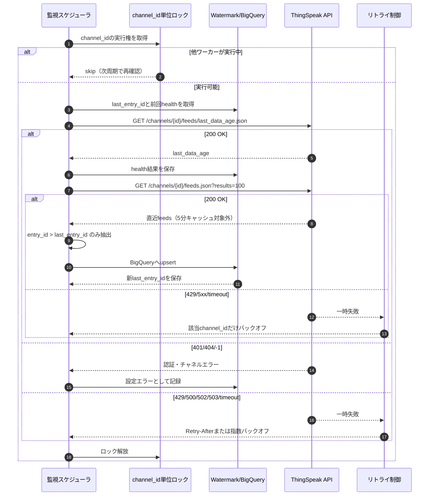

# ThingSpeak REST API調査とPython取得ラッパー設計

## 1. 調査目的

ThingSpeak REST APIからセンサーデータを安全に取得し、センサーの生存確認、過去データの一括取得、現在時点からの定期取得、BigQueryへのupsert投入に使えるPythonラッパーを設計する。対象は読み取り系APIを中心とし、書き込み、削除、チャネル作成などの破壊的操作は今回のラッパー対象外とする。

## 2. 結論

ThingSpeakの読み取りは、チャネル全フィールドを返す `GET /channels/{channel_id}/feeds.json`、単一フィールドを返す `GET /channels/{channel_id}/fields/{field_id}.json`、最新値を返す `GET /channels/{channel_id}/feeds/last.json`、最終更新からの秒数を返す `GET /channels/{channel_id}/feeds/last_data_age.json` を主軸に組み立てるのが妥当である。公式ドキュメントでは、feed取得の `results` 上限は8000件、private channelはRead API Keyが必要、アクセス不可時は `-1` が返ることがあると説明されている。

BigQuery upsert前提では、ThingSpeakの `entry_id` を主キー相当、`created_at` を時系列watermarkとして扱う。過去分の一括取得は `start` / `end` で期間を区切り、1回の戻り件数が8000件に達した場合は期間幅を縮める。現在以降の定期取得は、5分キャッシュの影響を避けるため `feeds/last.json` または `results<=100` の短いfeed取得を使い、既存の最大 `entry_id` より新しい行だけを投入する。

2026-05-19時点の追加確認では、ThingSpeak公式の[Channel Data Control](https://www.mathworks.com/help/thingspeak/channel-control.html)は「読み取りリクエスト間隔はThingSpeak側では制限されない」と説明している。したがって、1分間隔で同じチャネルに対して「生存確認」と「直近差分取得」を行うこと自体は、公式仕様上の読み取りレート制限には直接抵触しない。ただし、429 Too Many Requestsはエラーコードとして存在するため、複数チャネル・複数プロセス・障害時リトライが重なる運用では、同一チャネル単位の排他、指数バックオフ、直近feedの小件数取得を組み合わせるべきである。

## 3. API基本仕様

公式の[REST APIリファレンス](https://jp.mathworks.com/help/thingspeak/rest-api.html)では、ThingSpeakはHTTPのGET、POST、PUT、DELETEを使ってチャネル作成、削除、読み取り、書き込み、クリアを行うとされている。REST APIリクエストでHostヘッダーを設定する場合は `api.thingspeak.com` でなければ拒否される。

安全な取得処理では、[Channel Data Control](https://jp.mathworks.com/help/thingspeak/channel-control.html)に従い、HTTPSの `https://api.thingspeak.com` を使う。HTTPもサポートされているが、公式は非推奨としている。public channelの読み取りにはAPI Key不要、private channelの読み取りにはチャネル単位のRead API Keyが必要である。チャネル設定のprivate取得ではUser API Keyが必要で、Read API Keyとは別物である。

## 4. 読み取りAPI整理

| 用途 | HTTP | エンドポイント | 主要パラメータ | 戻り値 | 注意点 |
|---|---:|---|---|---|---|
| 全フィールド取得 | GET | `/channels/{channel_id}/feeds.json` | `api_key`, `results`, `start`, `end`, `days`, `minutes`, `timezone`, `status`, `metadata`, `location`, `min`, `max`, `round`, `timescale`, `sum`, `average`, `median` | `channel` と `feeds[]` | [Read Data](https://jp.mathworks.com/help/thingspeak/readdata.html)では `results` 最大8000件。`results` は集計系指定より優先度が高い。 |
| 単一フィールド取得 | GET | `/channels/{channel_id}/fields/{field_id}.json` | 全フィールド取得とほぼ同じ | `channel` と `feeds[]` | [Read Field](https://jp.mathworks.com/help/thingspeak/readfield.html)ではfield単位で最大8000件まで取得できる。 |
| 最新エントリ取得 | GET | `/channels/{channel_id}/feeds/last.json` | `api_key`, `timezone`, `offset`, `status`, `location` | 最新1件 | [Read Last Entry](https://jp.mathworks.com/help/thingspeak/readlastentry.html)は最新値監視に向く。 |
| 最終更新からの秒数 | GET | `/channels/{channel_id}/feeds/last_data_age.json` | なし | `last_data_age`, `last_data_age_units` | [Read Last Entry Age](https://jp.mathworks.com/help/thingspeak/readlastentryage.html)は生存確認の第一候補。private channelでの挙動は要実環境確認。 |
| ステータス履歴取得 | GET | `/channels/{channel_id}/status.json` | `api_key`, `results`, `days`, `timezone`, `offset` | statusの `feeds[]` | [Read Status](https://jp.mathworks.com/help/thingspeak/readstatus.html)はセンサー側がstatusを投稿している場合の補助情報になる。 |
| チャネル設定取得 | GET | `/channels/{channel_id}.json` | privateではUser API Key | チャネル設定 | [Read Settings](https://jp.mathworks.com/help/thingspeak/readsettings.html)でフィールド名、公開状態、最終entryなどを確認できる。 |

## 5. クエリ設計

`results` は取得件数の上限で、公式仕様上の最大は8000件である。無指定時は直近1日、または直近1440分がデフォルトになるため、履歴取得では必ず `start` / `end` または `days` / `minutes` を明示する。期間指定は `YYYY-MM-DD HH:NN:SS` 形式で、Python側ではUTCに正規化して送るのが扱いやすい。

`timezone` は表示上のタイムゾーン指定に使えるが、BigQuery側のupsertや統計処理ではAPIの `created_at` をUTC基準で保存し、表示層で変換する方が安全である。`average`, `median`, `sum`, `timescale` はThingSpeak側で集計済みデータを返せるが、BigQueryで再集計する想定なら生データ取得を基本にし、欠測補完や異常値処理の責任をBigQueryまたは前処理側に寄せる。

## 6. 制限と運用上の注意

[Channel Data Control](https://jp.mathworks.com/help/thingspeak/channel-control.html)では、無料ライセンスはチャネル更新が15秒ごと、有料ユーザーは1秒ごとで、読み取りリクエスト間隔はThingSpeak側では制限されないと説明されている。ただし[Error Codes](https://jp.mathworks.com/help/thingspeak/error-codes.html)には429 Too Many Requestsがあり、待ってから再試行する必要がある。

同じくChannel Data Controlでは、XMLまたはJSONで100件を超えるfeedが返る場合は5分キャッシュされ、最新呼び出しまたは `results=100` 以下のfeedはキャッシュされないと説明されている。このため、定期取得では `results<=100` または `feeds/last.json` を使う。過去一括取得ではキャッシュは問題になりにくいが、直近5分を含む大きなfeedを何度も読む設計は避ける。

[Licensing FAQ](https://thingspeak.mathworks.com/pages/license_faq)では、無料利用は非商用前提で年300万messages、4チャネルまで、更新間隔15秒と説明されている。商用用途はStandardライセンスが必要であり、取得システムを業務運用する場合はライセンス条件を別途確認する必要がある。

### 6.1 APIアクセス制限の実態

| 制限対象 | 公式情報 | 監視取得への影響 | 設計上の扱い |
|---|---|---|---|
| 読み取りリクエスト間隔 | [Channel Data Control](https://www.mathworks.com/help/thingspeak/channel-control.html)では、読み取りリクエスト間隔はThingSpeak側で制限されない。 | 1分間隔で同じチャネルを読む設計は、読み取り間隔制限そのものには抵触しない。 | ただし429は存在するため、無制限に並列化せず、チャネル単位で1ワーカーに集約する。 |
| 書き込み更新間隔 | 無料ライセンスは15秒ごと、有料ユーザーは1秒ごと。 | 今回の監視取得は読み取り中心なので直接の制限ではない。 | センサー側の送信周期と、取得側のポーリング周期を混同しない。 |
| JSON/XML feedキャッシュ | 100件を超えるfeedは5分キャッシュ。`last` 呼び出しまたは `results=100` 以下はキャッシュされない。 | 1分周期で `results>100` を読むと、最大5分古い同一応答を受け取る可能性がある。 | 生存確認は `last_data_age` または `feeds/last.json`、差分取得は `results<=100` を基本にする。 |
| 1回のfeed取得件数 | [Read Data](https://www.mathworks.com/help/thingspeak/readdata.html)では `results` 最大8000件。 | 過去範囲ダウンロードで8000件に張り付くと、期間内データを取り切れていない可能性がある。 | 8000件到達時は期間窓を縮小して再取得する。 |
| ライセンスmessage | [Licensing FAQ](https://thingspeak.mathworks.com/files/LicenseSpecsAndFAQ.pdf)ではmessageはチャネルへの書き込みで消費される。無料は年300万messages、4チャネル、15秒更新間隔。 | 読み取り監視自体はmessage消費の主因ではない。 | 取得頻度よりも、センサー投稿頻度・ThingSpeak Appsによる書き込み・派生チャネル書き込みを管理する。 |
| 429 Too Many Requests | [Error Codes](https://www.mathworks.com/help/thingspeak/error-codes.html)では、429は待機後に再要求する扱い。 | 読み取り無制限の説明があっても、混雑・異常リトライ・他APIでは429が発生し得る。 | `Retry-After` があれば従い、なければ指数バックオフとジッターを使う。 |

この整理から、1分間隔の「生存確認→範囲ダウンロード」は、`results<=100` の直近差分取得に限定する限り、5分キャッシュを避けて運用できる。逆に、毎分 `results=8000` や広い `start` / `end` 範囲を同じチャネルへ投げる設計は、5分キャッシュにより最新差分確認としては不適切で、API・ネットワーク・BigQuery投入の無駄も大きい。

## 7. センサー生存確認設計

生存確認は `last_data_age` の秒数を取得し、センサーの期待送信間隔に猶予を足した閾値と比較する。例として、送信間隔が60秒なら `max_age_seconds=180` のように3周期分を許容する。`last_data_age` が取れない場合は `feeds/last.json` の `created_at` から現在時刻との差分を計算して代替する。

判定結果は `alive`, `last_data_age_seconds`, `checked_at`, `last_entry` を保持する。BigQueryには生データとは別にヘルスチェック結果テーブルを作ると、センサー停止とデータ異常を分離して扱える。

## 8. 過去データ一括取得設計

過去分は `start` / `end` を指定して、1日単位などの時間窓に分割して取得する。1リクエストの `feeds` が8000件に達した場合、その時間窓はThingSpeakの上限に当たっている可能性があるため、時間窓を半日、1時間などに縮めて再取得する。取得済み行は `entry_id` で重複排除する。

BigQuery投入では、`entry_id` と `channel_id` の組み合わせをupsertキーにする。チャネルを跨ぐ可能性があるため、`entry_id` 単独ではなく `channel_id + entry_id` をキーにするのが安全である。`created_at` はパーティションキー候補、`field1` から `field8` は数値化可能なものを数値に変換し、空文字はNULLに寄せる。

## 9. 現在時点からの定期取得設計

定期取得は初回にBigQuery側の最大 `entry_id` または最大 `created_at` を読み、ThingSpeakから直近 `results<=100` を取得して差分だけ投入する。ポーリング間隔はセンサー送信間隔より短くしすぎない。ThingSpeak側の読み取り間隔に明示制限はないが、429やネットワーク失敗に備えて指数バックオフを行う。

取りこぼしを避けるには、現在時点からのpollだけに依存せず、定期的に「直近数時間の再取得」を行い、BigQuery upsertで重複を吸収する。これにより、一時的なネットワーク断やThingSpeak側の遅延に対して復旧しやすい。

### 9.1 1分間隔監視の推奨フロー

別ロジックから同じチャネルを定期監視する場合は、同一チャネルへのAPIアクセスを1つのポーリングワーカーに寄せる。生存確認用に `last_data_age`、差分取得用に `feeds.json?results=100` 以下を使い、広い範囲取得は通常ループから分離する。

1分周期の1チャネルあたり通常リクエスト数は、生存確認1回 + 差分取得1回の最大2回である。多数チャネルを扱う場合は、チャネルごとの開始時刻をずらし、同時刻に全チャネルへアクセスしない。ThingSpeakの読み取り間隔は明示制限されていないが、429や一時的な5xxを受けた場合は即時再試行せず、該当チャネルだけをバックオフさせる。



### 9.2 範囲ダウンロードとの切り分け

1分周期の通常ループでは、直近差分を取るために `results<=100` を使う。欠測復旧や取りこぼし検出のための範囲ダウンロードは、別ジョブとして5分から1時間に1回程度に分離し、`start` / `end` を「前回成功時刻から現在まで」または「直近数時間」に限定する。広い範囲を取得する場合、100件を超えるfeedは5分キャッシュされるため、最新監視の判定には使わず、BigQuery upsertによる補正用途と割り切る。

センサー送信が1分周期なら、`results=100` は約100分ぶんの余裕を持つ。ネットワーク断や429バックオフで数分停止しても、復帰後の1回の直近取得で差分を回収しやすい。送信周期が短いチャネルでは、1分あたりの想定投稿数に合わせて `results` を増やす必要があるが、ライブ監視用途では100件以下に収めることが5分キャッシュ回避の境界になる。

### 9.3 リトライと死活チェックの運用ルール

- 401、404、`-1` は設定・権限・チャネルIDの問題として扱い、短時間リトライを繰り返さない。
- 429、500、502、503、timeoutは一時失敗として扱い、`Retry-After` があればその秒数、なければ1分、2分、4分程度の指数バックオフにジッターを加える。
- バックオフは全体停止ではなく `channel_id` 単位にする。1チャネルの失敗で他チャネル監視を止めない。
- 生存確認は `last_data_age` を第一候補にし、取得できない場合だけ `feeds/last.json` の `created_at` で代替する。
- API疎通確認だけを目的に広い `feeds.json` を読まない。疎通確認は軽い `last_data_age` または `feeds/last.json` に寄せる。
- BigQuery投入は `channel_id + entry_id` で冪等化し、リトライや直近再取得による重複を許容する。

## 10. 実装したPythonラッパー

読み取り専用ラッパーを [src/thingspeak_client.py](../src/thingspeak_client.py) に作成した。主な機能は以下の通り。

| 機能 | メソッド | 内容 |
|---|---|---|
| 全フィールド取得 | `read_channel()` | `feeds.json` を取得する。 |
| 単一フィールド取得 | `read_field()` | `fields/{field_id}.json` を取得する。 |
| 最新値取得 | `read_last_entry()` | `feeds/last.json` を取得する。 |
| 生存確認 | `check_sensor_alive()` | `last_data_age` と閾値から `SensorHealth` を返す。 |
| 過去一括取得 | `iter_backfill_channel()` / `backfill_channel()` | `start` / `end` を時間窓で分割し、tqdmで進捗表示する。 |
| 定期取得 | `poll_new_entries()` | `results<=100` でキャッシュを避け、`entry_id` 差分をyieldする。 |
| upsert補助 | `normalize_feed_row()` / `filter_rows_after_entry_id()` | BigQuery投入前の数値化とwatermark差分抽出を行う。 |

安全面では、HTTPS以外の `base_url` を拒否し、APIキーをURLログからマスクし、アクセス不可時の `-1` を例外化し、429/500/502/503はリトライする。`loguru` でログを出し、過去取得の時間窓処理では `tqdm` を使う。

### 使用例

#### 1. 初期化とAPIキー管理

Read API Keyはprivate channelの読み取りに使う。User API Keyはチャネル設定のprivate取得に使うため、通常のデータ取得だけなら `read_api_key` のみでよい。キーはソースコードに直書きせず、環境変数や `.env` から読み込む。

```python
import os

from src import ThingSpeakClient

client = ThingSpeakClient(
    read_api_key=os.environ.get("THINGSPEAK_READ_API_KEY"),
    user_api_key=os.environ.get("THINGSPEAK_USER_API_KEY"),
    timeout_seconds=15,
    max_retries=3,
)
```

public channelの場合は `read_api_key` を省略できる。`base_url` はデフォルトで `https://api.thingspeak.com` を使い、HTTPS以外を指定すると例外にする。

#### 2. センサー生存確認

`check_sensor_alive()` は `last_data_age` を優先して取得し、指定した閾値以下なら `alive=True` を返す。`last_data_age` が取得できない場合は、最新エントリの `created_at` から経過秒数を推定する。

```python
from src import ThingSpeakClient

client = ThingSpeakClient(read_api_key="YOUR_READ_API_KEY")

health = client.check_sensor_alive(
    channel_id=123456,
    max_age_seconds=180,
)

if not health.alive:
    print("sensor down", health.last_data_age_seconds)
```

`max_age_seconds` はセンサー送信周期の2から3倍程度を初期値にする。例えば60秒周期なら180秒、15分周期なら45分程度を目安にする。

#### 3. 最新データの取得

最新値だけを確認する場合は `read_last_entry()` を使う。これは定期監視やダッシュボード更新に向く。

```python
latest = client.read_last_entry(
    channel_id=123456,
    timezone="Asia/Tokyo",
)

print(latest["entry_id"], latest["created_at"], latest.get("field1"))
```

#### 4. 過去データの一括取得

過去データは `backfill_channel()` または `iter_backfill_channel()` を使う。ThingSpeakは1回のfeed取得で最大8000件のため、`chunk` で期間を区切る。戻り件数が8000件に達した時間窓は、取りこぼしを避けるためchunkを短くして再実行する。

```python
from datetime import UTC, datetime, timedelta

from src import ThingSpeakClient

client = ThingSpeakClient(read_api_key="YOUR_READ_API_KEY")

rows = client.backfill_channel(
    123456,
    start=datetime(2026, 5, 1, tzinfo=UTC),
    end=datetime(2026, 5, 14, tzinfo=UTC),
    chunk=timedelta(days=1),
)
```

大量データをBigQueryへ逐次投入する場合は、メモリ保持を避けるため `iter_backfill_channel()` を使う。

```python
for row in client.iter_backfill_channel(
    123456,
    start=datetime(2026, 5, 1, tzinfo=UTC),
    end=datetime(2026, 5, 14, tzinfo=UTC),
    chunk=timedelta(hours=6),
):
    # rowはentry_id、created_at、field1..field8などを含む正規化済みdict
    load_to_bigquery(row)
```

#### 5. 現在時点からの定期取得

`poll_new_entries()` は直近feedを繰り返し取得し、`since_entry_id` より新しい行だけをyieldする。ThingSpeakの5分キャッシュを避けるため、デフォルトでは `results=100` 以下に制限している。

```python
last_entry_id = 1000  # BigQuery側で保存している最大entry_id

for row in client.poll_new_entries(
    channel_id=123456,
    since_entry_id=last_entry_id,
    interval_seconds=60,
    max_polls=10,
):
    upsert_to_bigquery(row)
    last_entry_id = max(last_entry_id, row["entry_id"])
```

常駐プロセスでは `max_polls=None` にする。運用上は常時pollに加えて、1時間に1回などの頻度で直近数時間を再取得し、BigQuery upsertで重複を吸収すると取りこぼしに強くなる。

#### 6. BigQuery upsert前の差分抽出

BigQuery側に保存済みの最大 `entry_id` がある場合は `filter_rows_after_entry_id()` を使う。時刻watermarkで処理したい場合は `filter_rows_after_created_at()` を使う。ただし、同一秒に複数データが入る可能性を考えると、主キーは `channel_id + entry_id` を推奨する。

```python
from src import filter_rows_after_entry_id, normalize_feed_row

payload = client.read_channel(123456)
rows = [normalize_feed_row(row) for row in payload["feeds"]]

new_rows = filter_rows_after_entry_id(rows, last_entry_id=1000)
for row in new_rows:
    upsert_to_bigquery(row)
```

BigQuery投入時の推奨カラムは以下である。

| カラム | 用途 |
|---|---|
| `channel_id` | チャネル識別子。投入時に付与する。 |
| `entry_id` | ThingSpeak内の連番。`channel_id` と組み合わせてupsertキーにする。 |
| `created_at` | センサー投稿時刻。パーティション、watermark、時系列集計に使う。 |
| `field1` - `field8` | センサー値。ラッパー側で数値化可能な値は `int` / `float`、空文字は `None` にする。 |
| `status`, `latitude`, `longitude`, `elevation` | 必要に応じて保持する補助情報。 |

#### 7. エラー処理

ラッパーはThingSpeak側のアクセス拒否、HTTPエラー、JSON不正、ネットワーク失敗を例外として扱う。429、500、502、503は指数バックオフでリトライする。

```python
from src import ThingSpeakClient, ThingSpeakError

client = ThingSpeakClient(read_api_key="YOUR_READ_API_KEY")

try:
    rows = client.backfill_channel(
        123456,
        start=datetime(2026, 5, 1, tzinfo=UTC),
        end=datetime(2026, 5, 14, tzinfo=UTC),
        chunk=timedelta(days=1),
    )
except ThingSpeakError as exc:
    # APIキー、チャネルID、ネットワーク、ThingSpeak側障害を確認する
    print(exc)
```

## 11. 残課題

実環境のprivate channelで `last_data_age` がRead API Keyなしでも取得できるかは、対象チャネルで確認が必要である。今回のラッパーは読み取り専用として安全側に寄せたため、ThingSpeakへの書き込み、Bulk Write、画像、TalkBack、Alertsは未実装である。BigQuery upsert部分はプロジェクト側のテーブル設計が未確定のため、今回は投入前の正規化と差分抽出に留めた。

## 12. 参考リンク

- [ThingSpeak REST API](https://jp.mathworks.com/help/thingspeak/rest-api.html)
- [Read Data](https://jp.mathworks.com/help/thingspeak/readdata.html)
- [Read Field](https://jp.mathworks.com/help/thingspeak/readfield.html)
- [Read Last Entry](https://jp.mathworks.com/help/thingspeak/readlastentry.html)
- [Read Last Entry Age](https://jp.mathworks.com/help/thingspeak/readlastentryage.html)
- [Read Status](https://jp.mathworks.com/help/thingspeak/readstatus.html)
- [Read Settings](https://jp.mathworks.com/help/thingspeak/readsettings.html)
- [Channel Data Control](https://jp.mathworks.com/help/thingspeak/channel-control.html)
- [Error Codes](https://jp.mathworks.com/help/thingspeak/error-codes.html)
- [Channel Data Control (MathWorks English)](https://www.mathworks.com/help/thingspeak/channel-control.html)
- [Read Data (MathWorks English)](https://www.mathworks.com/help/thingspeak/readdata.html)
- [Error Codes (MathWorks English)](https://www.mathworks.com/help/thingspeak/error-codes.html)
- [ThingSpeak Licensing FAQ](https://thingspeak.mathworks.com/pages/license_faq)
- [ThingSpeak License Specs and FAQ PDF](https://thingspeak.mathworks.com/files/LicenseSpecsAndFAQ.pdf)
